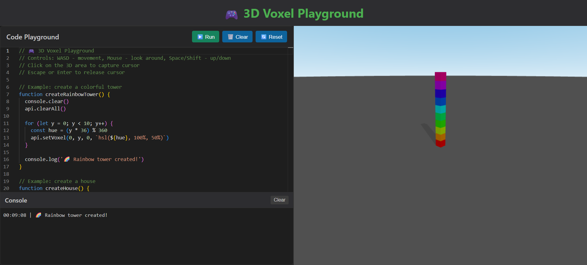

*The entirety of this project is vibe coded, with a few minor manual fixes*

# 3D Voxel Grid Playground

Interactive playground for programmatic manipulation of a 3D voxel grid.

[Try it out!](https://s809.github.io/voxel-playground/)



## Quick Start

### Install Dependencies
```bash
npm install
```

### Run Development Server
```bash
npm run dev
```

### Build for Production
```bash
npm run build
```

### Preview Build
```bash
npm run preview
```
